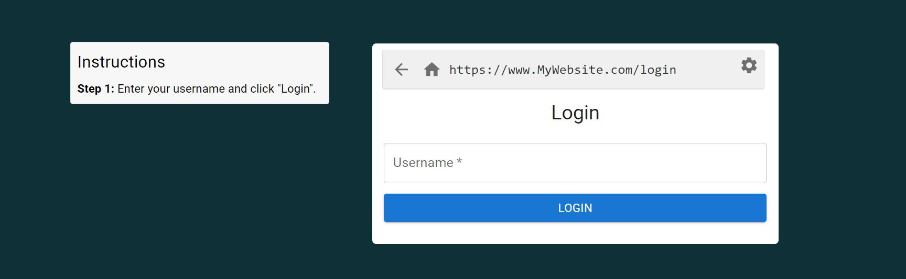
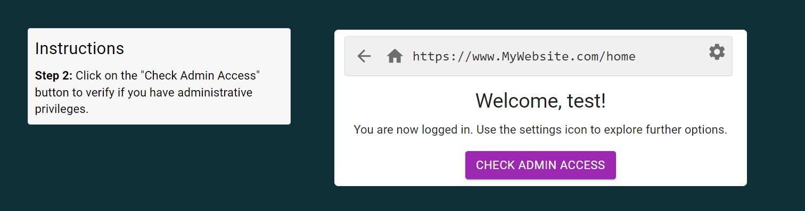
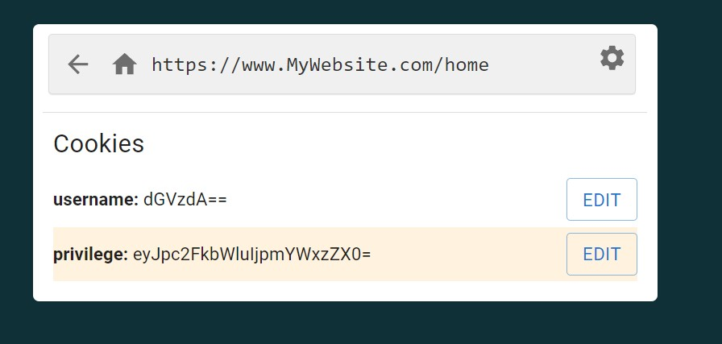
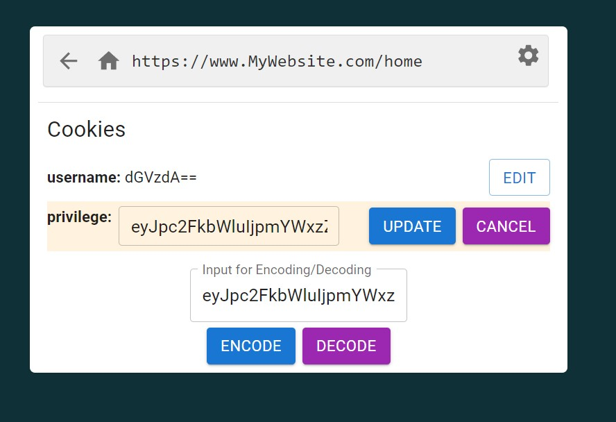
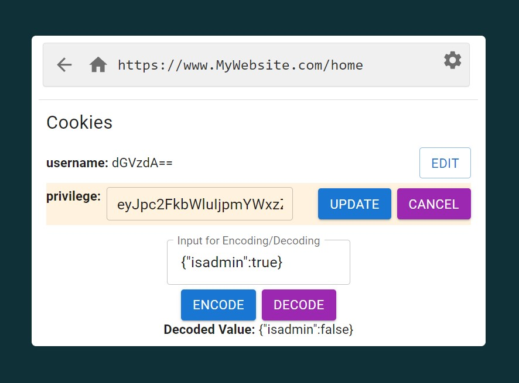
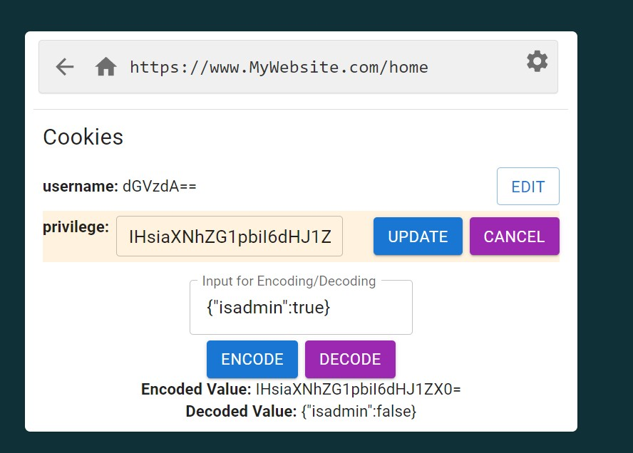
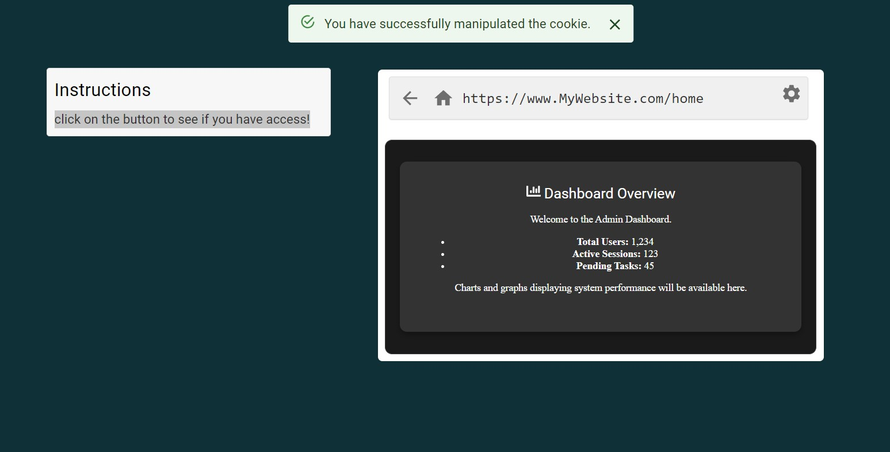

### Procedure

Step1:Enter your username and click "Login"

 

Step 2: Click on the "Check Admin Access" button to verify if you have administrative privileges.

  

Step 3: Since access is denied, let's try manipulating the cookie to gain administrative privileges

   

click on the settings icon and select "Browser Cookie" to proceed.

 

Step 4: Use the Encode/Decode tool to experiment with base64 encoding and decoding.

    

Try copying and pasting the encoded values, then use the toolbar to decode them. Familiarize yourself with the base64 toolbar.  

     

Step 5: Follow these instructions to manipulate the privilege cookie:

<li>Find the privilege cookie in the list.</li>

<li>Click edit button and copy the value of the privilege cookie.</li>

<li>Paste the copied value into the input field in the toolbar.</li>

<li>Click "Decode" to view the current value of the privilege cookie</li>

<li>Copy the decoded value {"isadmin":false} and Paste the value in input feild of the toolbar </li>

<li>Change `"false"` to `"true"` in the decoded value.</li>

<li>Click "Encode" to encode the updated value.</li>

<li>Replace the original privilege cookie value with the newly encoded value.</li>

<li>Click "Update" to apply the changes.,click "go home" to proceed</li>

<li>click on the button to see if you have access!</li>

<li>Sucessfully manipulated the cookie </li>

