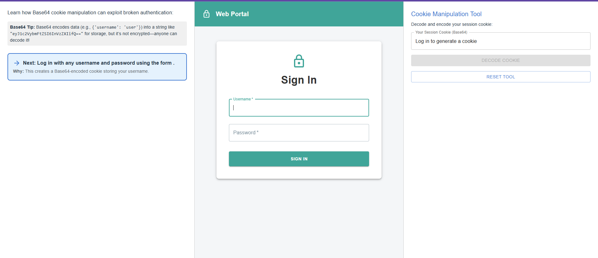
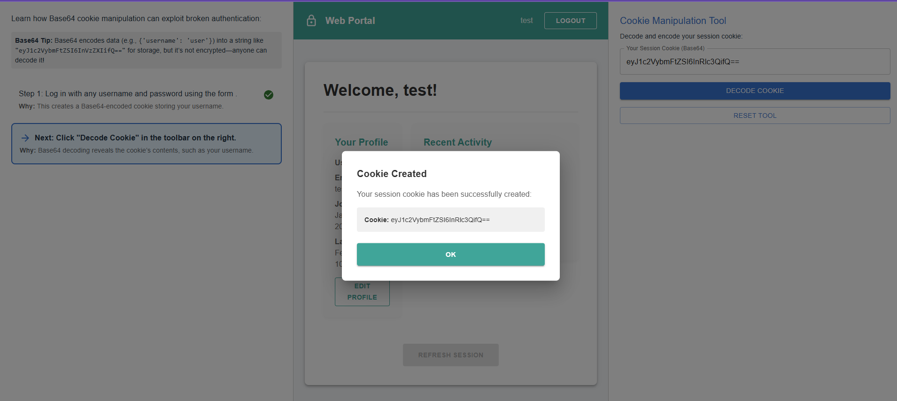
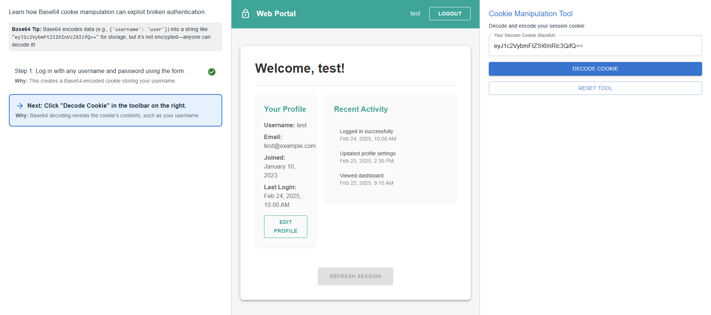
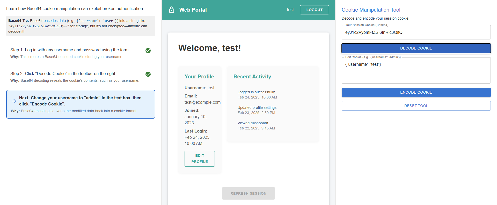
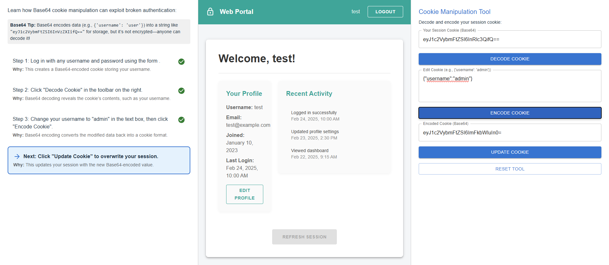
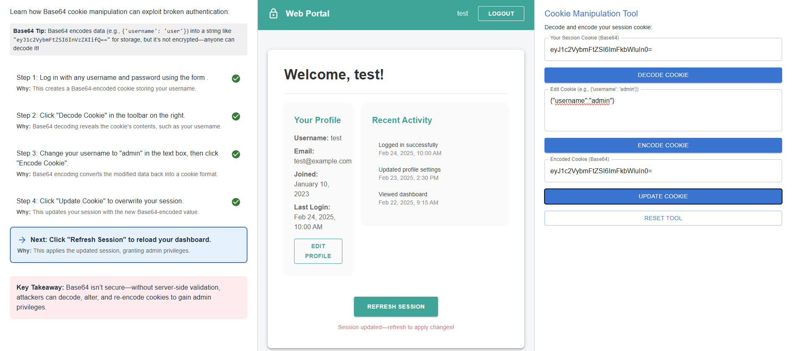
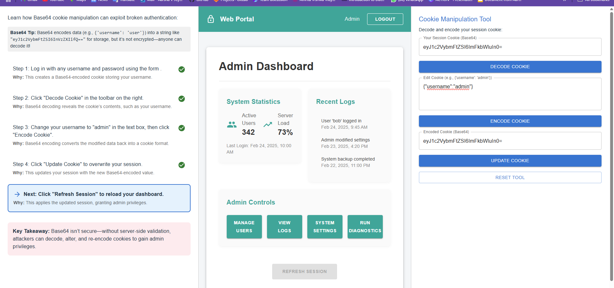

### Procedure

<b>
Log in with any username and password using the form .
</b>

 
 
When you log in using the form, the application creates a Base64-encoded cookie that stores your username. This cookie is used to maintain your session, and it determines your access level within the application.

 <b> 
Your session cookie has been successfully created
</b>
 

 
 
After logging in, navigate to the Cookie Manipulation Tool, where your Base64-encoded session cookie is displayed. This cookie stores your username and determines your access level. We will use this tool to decode, modify, and re-encode the cookie to manipulate privileges and gain unauthorized access.

 <b>
 Click "Decode Cookie" in the toolbar on the right.
</b>
 
Click the "Decode Cookie" button to convert the Base64-encoded session cookie into a readable JSON format, revealing the stored username and privileges. This structure can be manipulated to escalate access.

 

<b>
 Change your username to "admin" in the text box, then click "Encode Cookie".
</b>

Change the username to "admin" in the text box, then click "Encode Cookie" to convert the modified data back into Base64 format. This new encoded cookie can be used to escalate privileges.

 
 <b>
Click "Update Cookie" to overwrite your session.
</b>
 
Click "Update Cookie" to overwrite your session with the modified Base64-encoded value, effectively changing your user privileges.

<b>
Click "Refresh Session" to reload your dashboard.
</b>

Click "Refresh Session" to reload your dashboard and apply the updated session, granting admin privileges.

Hence, you have successfully broken authentication and gained unauthorized access to the admin dashboard by manipulating the session cookie. This happens due to the lack of proper session integrity checks, allowing users to modify and encode their own authentication data without validation.
